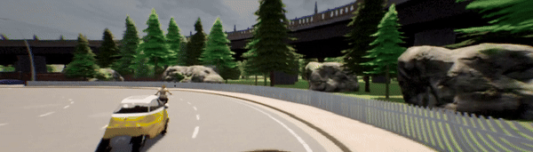

# T4PC

## TCP property conformance improvement for stop signs
This video shows **TCP fine-tuned without property loss** running in one of the evaluation routes in CARLA, and we can see how it **runs a stop sign.**.



This video shows **TCP fine-tuned with T4PC** running in the same evaluation route in CARLA, but in this case we can see that TCP safely **stops at the stop sign**.


## Appendix Tables

### Splits
| Split             | Train   | Val    | Test  |
|-------------------|---------|--------|-------|
| Town 01 left out  | 345,757 | 45,674 | 9,056 |
| Town 02 left out  | 338,732 | 48,040 | 6,690 |
| Town 04 left out  | 361,018 | 47,564 | 7,166 |
| Town 05 left out  | 339,656 | 43,480 | 11,250|
| Town 07 left out  | 366,186 | 45,251 | 9,479 |
| Town 10 left out  | 344,416 | 43,641 | 11,089|

### Preconditions
| Split             | $\phi_1$  | $\phi_2$  | $\phi_3$  | $\phi_4$  | $\phi_5$  | $\phi_6$  |
|-------------------|-----------|-----------|-----------|-----------|-----------|-----------|
| Town 01 left out  | 71,590    | 114,279   | 58,813    | 21,538    | 190,678   | 173,238   |
| Town 02 left out  | 64,462    | 114,947   | 62,016    | 20,310    | 185,042   | 167,602   |
| Town 04 left out  | 82,899    | 124,266   | 51,394    | 24,732    | 220,419   | 205,241   |
| Town 05 left out  | 80,600    | 108,778   | 55,791    | 22,618    | 217,678   | 212,275   |
| Town 07 left out  | 75,898    | 136,267   | 60,898    | 26,541    | 223,841   | 206,229   |
| Town 10 left out  | 75,546    | 127,588   | 55,513    | 23,771    | 224,367   | 210,240   |
| **Average**       | 75,166    | 121,021   | 57,404    | 23,252    | 210,338   | 195,804   |

### Towns

| Town   | # Images |
|--------|--------|
| town01 | 82,452 |
| town02 | 87,111 |
| town04 | 65,301 |
| town05 | 90,747 |
| town07 | 62,446 |
| town10 | 85,826 |

### Sec IV number of violations
We present the number of violations for each property and split in the controlled experiment. The number of violations is divided into two categories: $\mathcal{B}$ and $\mathcal{M}$, which represent the number of violations for the base model and the model fine-tuned with T4PC, respectively. These violations appear on the towns left out during training. We added 3 csv files called rq1_violations_table.csv, rq2_violations_table.csv, and rq3_violations_table.csv containing the following tables in the root folder.

#### RQ1
| Properties                        | Split   | $\mathcal{B}$ | $\mathcal{M}$ |
|:----------------------------------|:-------:|--------------:|--------------:|
| $\phi_1$ - StopToAvoidCollision   | 0       | 180 | 54 |
|    | 1       | 121 | 26 |
|    | 2       | 37 | 15 |
|    | 3       | 94 | 52 |
|    | 4       | 126 | 48 |
|    | 5       | 34 | 15 |
|    | total       | 592 | 210 |
| $\phi_2$ - StopForYellowRed   | 0       | 1056 | 447 |
|    | 1       | 608 | 88 |
|    | 2       | 631 | 51 |
|    | 3       | 652 | 63 |
|    | 4       | 389 | 285 |
|    | 5       | 1178 | 146 |
|    | total       | 4514 | 1080 |
| $\phi_3$ - NoStopForNoReason   | 0       | 19 | 3 |
|    | 1       | 92 | 83 |
|    | 2       | 83 | 6 |
|    | 3       | 163 | 62 |
|    | 4       | 404 | 109 |
|    | 5       | 1215 | 1232 |
|    | total       | 1976 | 1495 |
| $\phi_4$ - AccelerateForGreen   | 0       | 61 | 10 |
|    | 1       | 76 | 35 |
|    | 2       | 26 | 7 |
|    | 3       | 235 | 81 |
|    | 4       | 40 | 4 |
|    | 5       | 93 | 31 |
|    | total       | 531 | 168 |
| $\phi_5$ - NoSteerRightOutRoad   | 0       | 1503 | 0 |
|    | 1       | 1041 | 0 |
|    | 2       | 626 | 0 |
|    | 3       | 2468 | 0 |
|    | 4       | 232 | 0 |
|    | 5       | 365 | 0 |
|    | total       | 6235 | 0 |
| $\phi_6$ - NoSteerLeftOutRoad   | 0       | 0 | 0 |
|    | 1       | 0 | 0 |
|    | 2       | 0 | 0 |
|    | 3       | 0 | 0 |
|    | 4       | 0 | 0 |
|    | 5       | 0 | 0 |
|    | total       | 0 | 0 |


#### RQ2
| Properties                        | Split   | $\mathcal{B}$ | $\mathcal{M}$ |
|:----------------------------------|:-------:|--------------:|--------------:|
| $\phi_1$ - StopToAvoidCollision   | 0       | 200 | 43 |
|    | 1       | 106 | 16 |
|    | 2       | 34 | 14 |
|    | 3       | 92 | 51 |
|    | 4       | 128 | 60 |
|    | 5       | 33 | 13 |
|    | total       | 593 | 197 |
| $\phi_2$ - StopForYellowRed   | 0       | 1116 | 333 |
|    | 1       | 586 | 70 |
|    | 2       | 647 | 60 |
|    | 3       | 675 | 102 |
|    | 4       | 402 | 274 |
|    | 5       | 1156 | 115 |
|    | total       | 4582 | 954 |
| $\phi_3$ - NoStopForNoReason   | 0       | 15 | 5 |
|    | 1       | 94 | 69 |
|    | 2       | 84 | 3 |
|    | 3       | 154 | 67 |
|    | 4       | 398 | 103 |
|    | 5       | 1280 | 1000 |
|    | total       | 2025 | 1247 |
| $\phi_4$ - AccelerateForGreen   | 0       | 50 | 16 |
|    | 1       | 77 | 20 |
|    | 2       | 27 | 2 |
|    | 3       | 227 | 97 |
|    | 4       | 36 | 10 |
|    | 5       | 101 | 13 |
|    | total       | 518 | 158 |
| $\phi_5$ - NoSteerRightOutRoad   | 0       | 1541 | 0 |
|    | 1       | 1089 | 0 |
|    | 2       | 636 | 0 |
|    | 3       | 2431 | 0 |
|    | 4       | 242 | 0 |
|    | 5       | 380 | 0 |
|    | total       | 6319 | 0 |
| $\phi_6$ - NoSteerLeftOutRoad   | 0       | 0 | 0 |
|    | 1       | 0 | 0 |
|    | 2       | 0 | 0 |
|    | 3       | 0 | 0 |
|    | 4       | 0 | 0 |
|    | 5       | 0 | 0 |
|    | total       | 0 | 0 |


### RQ3
| Properties                        | Split   | $\mathcal{B}$ | $\mathcal{M}$ |
|:----------------------------------|:-------:|--------------:|--------------:|
| $\phi_1$ - StopToAvoidCollision   | 0       | 150 | 29 |
|    | 1       | 123 | 46 |
|    | 2       | 37 | 54 |
|    | 3       | 96 | 36 |
|    | 4       | 126 | 239 |
|    | 5       | 28 | 24 |
|    | total       | 560 | 428 |
| $\phi_2$ - StopForYellowRed   | 0       | 994 | 196 |
|    | 1       | 608 | 72 |
|    | 2       | 631 | 43 |
|    | 3       | 659 | 83 |
|    | 4       | 388 | 248 |
|    | 5       | 757 | 272 |
|    | total       | 4037 | 914 |
| $\phi_3$ - NoStopForNoReason   | 0       | 27 | 61 |
|    | 1       | 92 | 147 |
|    | 2       | 83 | 77 |
|    | 3       | 154 | 116 |
|    | 4       | 404 | 372 |
|    | 5       | 1576 | 1464 |
|    | total       | 2336 | 2237 |
| $\phi_4$ - AccelerateForGreen   | 0       | 59 | 81 |
|    | 1       | 77 | 59 |
|    | 2       | 26 | 13 |
|    | 3       | 227 | 149 |
|    | 4       | 40 | 14 |
|    | 5       | 164 | 219 |
|    | total       | 593 | 535 |
| $\phi_5$ - NoSteerRightOutRoad   | 0       | 1506 | 0 |
|    | 1       | 1037 | 0 |
|    | 2       | 625 | 0 |
|    | 3       | 2371 | 0 |
|    | 4       | 234 | 0 |
|    | 5       | 0 | 0 |
|    | total       | 5773 | 0 |
| $\phi_6$ - NoSteerLeftOutRoad   | 0       | 0 | 0 |
|    | 1       | 0 | 0 |
|    | 2       | 0 | 0 |
|    | 3       | 0 | 0 |
|    | 4       | 0 | 0 |
|    | 5       | 0 | 0 |
|    | total       | 0 | 0 |


## Reproduce results
### Conda environment
1. Create a conda environment
```bash
conda env create -f environment.yml --prefix .t4pc
```

2. Activate the environment
```bash
conda activate .t4pc
```

### RQ1, RQ2, and RQ3
1. Download the violations csv files by running:
```bash
python downloader.py --option controlled_experiment_results
```

2. Run the following script to plot the results:
```bash
python controlled_experiment/plot.py
```
Figure 3 in the paper will be generated at `./controlled_experiment/results.png`.

### TCP Controlled Experiment
1. Download the results.json files by running:
```bash
python downloader.py --option case_study_results
```

2. To render the full table with the results, execute the cells in the Jupyter notebook `case_study/results_summary.ipynb`.


## Run full experiments: RQ1, RQ2, and RQ3

### Conda environment
1. Create a conda environment
```bash
conda env create -f environment.yml --prefix .t4pc
```

2. Activate the environment
```bash
conda activate .t4pc
```

### Download the dataset
Download the dataset by running:
```bash
python downloader.py --option dataset
```

### Defining directories paths
You need to define the variables in the .env sample file. The variables are: ROOT_DIR, DATASET_DIR, CARLA_DIR.

### Execution scripts
The scripts are designed to run in a SLURM server. The scripts need to be executed sequentially, consequently, execute each of the commands after all the previous SLURM jobs are completed. To launch the experiments, execute the following command:
```bash
python controlled_experiment/slurm_scripts/rq1_runner.py
python controlled_experiment/slurm_scripts/rq2_runner.py
python controlled_experiment/slurm_scripts/rq3_runner.py
```
Note that some of the SBATCH parameters inside `controlled_experiment/rq1/sbatch_rq1.sh`, `controlled_experiment/rq2/sbatch_rq2.sh`, and `controlled_experiment/rq3/sbatch_rq3.sh` may need to be adjusted to the specific server configuration.

### Plot scripts
To plot the results. Run the following script:
```bash
python controlled_experiment/plot.py
```


## Run full case study: TCP

### Conda environment
1. Create a conda environment
```bash
conda env create -f environment.yml --prefix .t4pc
```

2. Activate the environment
```bash
conda activate .t4pc
```

### Download Carla
Download CARLA 0.9.10.1 and the additional maps by running:
```bash
mkdir carla
cd carla
wget https://tiny.carla.org/carla-0-9-10-1-linux
wget https://tiny.carla.org/additional-maps-0-9-10-1-linux
tar -xf CARLA_0.9.10.1.tar.gz
tar -xf AdditionalMaps_0.9.10.1.tar.gz
rm CARLA_0.9.10.1.tar.gz
rm AdditionalMaps_0.9.10.1.tar.gz
cd ..
```

### Download files
1. Download the dataset by running:
```bash
python downloader.py --option dataset
```
2. Download the TCP base model by running:
```bash
python downloader.py --option tcp_model
```

### Defining directories paths
You need to define the variables in the .env sample file. The variables are: ROOT_DIR, DATASET_DIR, CARLA_DIR.

### Training and benchmark scripts
The scripts are designed to run in a SLURM server. The file `case_study/slurm_scripts/experiment.sh` contains the commands to run the training and benchmarking for all models. To launch the experiments, execute the following command:
```bash
python case_study/slurm_scripts/experiment.sh
```
Note that some of the SBATCH parameters inside `case_study/slurm_scripts/sbatch_training.sh` and `case_study/slurm_scripts/sbatch_benchmark.sh` may need to be adjusted to the specific server configuration.
